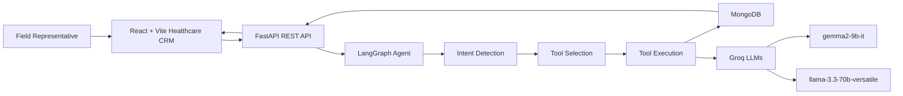

# HelixCRM AI

HelixCRM AI is a production-style AI-first Healthcare CRM for pharmaceutical field representatives. It simulates a modern enterprise HCP interaction platform inspired by Veeva CRM and Salesforce Health Cloud, with structured interaction logging, conversational AI support, MongoDB persistence, and LangGraph orchestration.

## Architecture



## Features

- Login page with clean healthcare SaaS styling
- Enterprise dashboard with interaction metrics, follow-ups, sentiment, recent activity, and AI insights
- Main Log Interaction screen with structured HCP form and AI copilot side panel
- Interaction History with search, sentiment filter, edit action, and AI summaries
- Redux Toolkit slices: `authSlice`, `interactionSlice`, `aiAssistantSlice`, `dashboardSlice`
- FastAPI async API with Pydantic validation, service layer, structured logging, and error handling
- LangGraph workflow: user input -> intent detection -> tool selection -> tool execution -> MongoDB storage -> AI response
- Groq integration with primary model `gemma2-9b-it` and fallback `llama-3.3-70b-versatile`
- MongoDB collections for `users`, `hcps`, `interactions`, and `ai_activity_logs`
- Dockerized frontend, backend, and MongoDB stack
- Deployment-ready configuration for Vercel, Render, Railway, and MongoDB Atlas
- AI conversational CRM assistant powered by LangGraph and Groq LLMs

## LangGraph Tools

- `log_interaction`: saves interaction data, summarizes notes, extracts doctors/products/diseases, analyzes sentiment, stores action items
- `edit_interaction`: modifies interaction records and tracks updated fields
- `summarize_interaction`: creates concise CRM-ready meeting summaries
- `analyze_sentiment`: returns Positive, Neutral, or Negative with confidence and rationale
- `suggest_followup`: recommends next best actions such as send brochure, schedule follow-up, share clinical trial, or sample follow-up
- `fetch_hcp_history`: retrieves previous HCP interactions and generates contextual insights

## Tech Stack

- Frontend: React, Vite, TailwindCSS, Redux Toolkit, React Router, Axios, Inter font
- Backend: Python 3.11+, FastAPI, LangGraph, LangChain, Groq, Pydantic, Motor
- Database: MongoDB local container or MongoDB Atlas
- Deployment: Docker Compose, Vercel frontend, Render/Railway backend

## Folder Structure

```text
ai-healthcare-crm/
  frontend/
    src/app
    src/components
    src/features
    src/pages
    src/services
  backend/
    app/agents
    app/agents/tools
    app/api/v1/routes
    app/core
    app/db
    app/models
    app/schemas
    app/services
    app/utils
  docs/
  scripts/
  screenshots/
  docker-compose.yml
  render.yaml
  requirements.txt
  .env.example
```

## Environment Variables

Copy `.env.example` to `.env` for local customization.

```env
APP_ENV=development
MONGO_URI=mongodb://mongo:27017
MONGO_DB=helixcrm
GROQ_API_KEY=replace-with-your-groq-key
PRIMARY_MODEL=gemma2-9b-it
SECONDARY_MODEL=llama-3.3-70b-versatile
VITE_API_BASE_URL=http://localhost:8000/api/v1
CORS_ORIGINS=http://localhost:5173,http://localhost:8080,http://127.0.0.1:5173
```

## Complete Execution Guide

### A. Installation

Install:

- Python 3.11+
- Node.js latest LTS
- Docker Desktop
- VS Code

### B. Python Virtual Environment

```powershell
cd backend
py -3.11 -m venv .venv
.\.venv\Scripts\activate
python -m pip install -r requirements.txt
```

### C. Node.js Setup

```powershell
cd frontend
npm install
```

### D. MongoDB Setup

Recommended local path:

```powershell
docker run --name helixcrm-mongo -p 27017:27017 -d mongo:7
```

Set backend development URI:

```env
MONGO_URI=mongodb://localhost:27017
```

### E. Docker Setup

Start Docker Desktop first, then:

```powershell
docker compose up --build
```

Frontend: `http://localhost:8080`

Backend: `http://localhost:8000`

API docs: `http://localhost:8000/docs`

The MongoDB container is reachable by the backend at `mongodb://mongo:27017`. It is not published to the host by default, which avoids conflicts with a local MongoDB service already using port `27017`.

### F. Backend Run Commands

```powershell
cd backend
.\.venv\Scripts\activate
uvicorn app.main:app --reload
```

### G. Frontend Run Commands

```powershell
cd frontend
npm run dev
```

Frontend dev server: `http://localhost:5173`

### H. Docker Run Commands

```powershell
docker compose up --build
docker compose down
docker compose logs -f backend
```

### I. Production Build Commands

```powershell
cd frontend
npm run build
npm run preview
```

Backend container build:

```powershell
docker build -t helixcrm-ai-backend ./backend
```

### J. Deployment Commands

Vercel frontend:

```powershell
cd frontend
vercel
```

Render backend:

```powershell
git push origin main
```

Then create a Render Web Service using `backend/Dockerfile` or `render.yaml`.

MongoDB Atlas:

1. Create a cluster.
2. Add database user.
3. Allow backend outbound IPs.
4. Set `MONGO_URI` in Render/Railway environment variables.

## API Documentation

FastAPI docs are available at `/docs`.

Core endpoints:

- `POST /interactions`
- `PUT /interactions/{id}`
- `GET /interactions`
- `GET /interactions/{id}`
- `GET /interactions/hcp/history?hcpName=Dr.%20Aisha%20Menon`
- `POST /agent/chat`
- `POST /agent/summarize`
- `POST /agent/sentiment`

The same endpoints are also available under `/api/v1`.

Example agent chat:

```json
{
  "message": "summarize this meeting",
  "draftInteraction": {
    "hcpName": "Dr. Aisha Menon",
    "interactionType": "Virtual call",
    "date": "2026-05-07",
    "time": "10:30",
    "notes": "HCP requested GLP-1 adherence material and clinical evidence."
  }
}
```

## Screenshots

Add walkthrough screenshots to `screenshots/`:

- Login page
- Dashboard
- Log Interaction screen
- AI Assistant panel
- Interaction History

## Troubleshooting

- `npm.ps1 cannot be loaded`: use `npm.cmd install` and `npm.cmd run dev` on Windows PowerShell.
- `MongoDB is unavailable`: start Docker Desktop and run `docker compose up mongo`, or set `MONGO_URI` to MongoDB Atlas.
- `GROQ_API_KEY` missing: the app still works with deterministic fallback AI responses.
- Docker engine error: open Docker Desktop and wait until it says the engine is running.
- CORS blocked: add your frontend domain to `CORS_ORIGINS`.
- Port in use: change frontend `vite.config.js` port or run uvicorn with `--port 8001`.

## Future Improvements

- Role-based access control and SSO
- Audit trail export for compliance teams
- HCP master-data sync
- Offline-first mobile field mode
- Advanced MSL handoff workflow
- Test suite with MongoDB test containers
- Fine-grained prompt observability and evaluation dashboards
